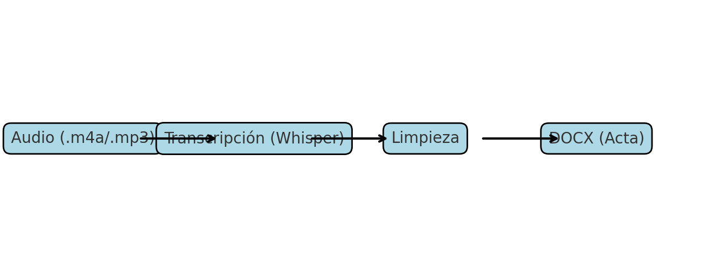

# Actas desde audio (Python + Whisper + DOCX)


Convierte **audios de reuniones** en **actas formales editables** en minutos.


## 🚀 Flujo
1. Audio (.m4a/.mp3) → 2. Transcripción (Whisper) → 3. Limpieza → 4. DOCX



## 📦 Requisitos
- Python 3.10+
- ffmpeg instalado
- Paquetes:
  ```bash
  pip install -r requirements.txt
